# 🤖 AI Assistant with Tool Calling

A smart AI assistant powered by Groq that can intelligently decide when to use external tools (calculator and weather) versus answering questions directly.

## ✨ Features

- **Intelligent Tool Routing**: Automatically determines when to use tools vs. direct responses
- **6 Professional Tools**:
  - 🧮 **Calculator** - Advanced mathematical calculations
  - 🌤️ **Weather** - Real-time weather information
  - 📊 **Data Analyzer** - Statistical analysis (mean, median, mode, std dev)
  - 🔐 **Password Generator** - Secure password creation
  - 📧 **Email Address Validator** - Email format validation
  - 💱 **Currency Converter** - Multi-currency conversion
- **Modern UI**: Beautiful, responsive chat interface with light theme
- **Fast Responses**: Powered by Groq's ultra-fast LLM API


> **Live Demo**: Run `python app.py` and visit `http://localhost:5000` to see it in action!

---

---

## 📋 Table of Contents

- [Features](#-features)
- [Architecture](#️-architecture)
- [Quick Start](#-quick-start)
- [Usage Examples](#-usage-examples)
- [Technology Stack](#️-technology-stack)
- [Project Structure](#-project-structure)
- [How It Works](#-how-it-works)
- [API Reference](#-api-reference)
- [Deployment](#-deployment)
- [Support](#-support)

---

## 🏗️ Architecture

```mermaid
graph TB
    subgraph "Frontend"
        UI[Chat Interface<br/>HTML/CSS/JS]
    end
    
    subgraph "Backend - Flask Server"
        API["/api/chat<br/>Endpoint"]
        ORCH[AI Orchestrator]
        
        subgraph "Tools"
            CALC[Calculator Tool<br/>🧮]
            WEATHER[Weather Tool<br/>🌤️]
        end
    end
    
    subgraph "External Services"
        GROQ[Groq API<br/>llama-3.3-70b]
    end
    
    UI -->|POST /api/chat| API
    API --> ORCH
    ORCH -->|1. Analyze Query| GROQ
    GROQ -->|Tool Decision| ORCH
    ORCH -->|Execute if needed| CALC
    ORCH -->|Execute if needed| WEATHER
    CALC -->|Result| ORCH
    WEATHER -->|Result| ORCH
    ORCH -->|2. Generate Response| GROQ
    GROQ -->|Final Answer| ORCH
    ORCH -->|JSON Response| API
    API -->|Display| UI
    
    style UI fill:#6366f1,stroke:#4f46e5,color:#fff
    style GROQ fill:#ec4899,stroke:#db2777,color:#fff
    style CALC fill:#14b8a6,stroke:#0d9488,color:#fff
    style WEATHER fill:#14b8a6,stroke:#0d9488,color:#fff
    style ORCH fill:#8b5cf6,stroke:#7c3aed,color:#fff
```



## 🔄 Request Flow

### Example: Calculator Query

```
User: "What is 245 * 678?"
    ↓
1. Frontend sends POST to /api/chat
    ↓
2. AI Orchestrator calls Groq AI
    ↓
3. Groq decides: "Need calculator tool"
    ↓
4. Execute calculator(expression="245 * 678")
    ↓
5. Calculator returns: {"result": 166110}
    ↓
6. AI Orchestrator calls Groq with result
    ↓
7. Groq generates: "The result is 166,110"
    ↓
8. Response sent to frontend with tool badge
```

### Example: General Query (No Tools)

```
User: "What is artificial intelligence?"
    ↓
1. Frontend sends POST to /api/chat
    ↓
2. AI Orchestrator calls Groq AI
    ↓
3. Groq decides: "No tools needed"
    ↓
4. Groq generates direct response
    ↓
5. Response sent to frontend (no tool badge)
```

## 🚀 Quick Start

### Prerequisites

- Python 3.8 or higher
- Groq API key

### Installation

1. **Clone or download this project**

2. **Install dependencies**
   ```bash
   pip install -r requirements.txt
   ```

3. **Set up environment variables**
   
   The `.env` file is already configured with your Groq API key.
   
   Or create your own:
   ```bash
   cp .env.example .env
   # Edit .env and add your GROQ_API_KEY
   ```

4. **Run the application**
   ```bash
   python app.py
   ```

5. **Open your browser**
   
   Navigate to `http://localhost:5000`

## 💬 Usage Examples

### 🧮 Calculator
- "What is 245 * 678?"
- "Calculate sqrt(144)"
- "What's 12 / 3 + 7?"
- "What is sin(pi/2)?"

### 🌤️ Weather
- "What's the weather in Chennai?"
- "Tell me the weather in Mumbai"
- "How's the weather in Bangalore?"

### 📊 Data Analyzer
- "Analyze these numbers: 10, 20, 30, 40, 50"
- "Calculate statistics for: 5.5, 12.3, 8.7, 15.2, 9.1"
- "Find mean and median of: 100, 200, 150, 175, 225"

### 🔐 Password Generator
- "Generate a strong password"
- "Create a 16-character password with symbols"
- "Generate a password without special characters"

### 📧 Email Address Validator
- "Validate this email: user@example.com"
- "Is john.doe@gmail.com a valid email?"
- "Check if test@domain is valid"

### 💱 Currency Converter
- "Convert 100 USD to INR"
- "How much is 50 EUR in GBP?"
- "Convert 1000 INR to USD"

### 💬 General Questions
- "What is artificial intelligence?"
- "Explain how neural networks work"
- "Tell me a joke"

## 🛠️ Technology Stack

- **Backend**: Flask (Python)
- **AI Model**: Groq (llama-3.3-70b-versatile)
- **Frontend**: Vanilla JavaScript, HTML5, CSS3
- **Styling**: Custom CSS with glassmorphism effects

## 📁 Project Structure

```
ToolAI/
├── app.py                 # Flask backend with AI orchestration
├── requirements.txt       # Python dependencies
├── .env                   # Environment variables (API key)
├── .env.example          # Template for environment variables
├── .gitignore            # Git ignore rules
├── README.md             # This file
├── templates/
│   └── index.html        # Main HTML page
└── static/
    ├── style.css         # Styling with glassmorphism
    └── app.js            # Frontend JavaScript logic
```

## 🔧 How It Works

### Tool Definitions

The backend defines tools using JSON schema that Groq's function calling API understands:

```python
TOOLS = [
    {
        "type": "function",
        "function": {
            "name": "calculator",
            "description": "Use this tool for any mathematical calculation",
            "parameters": {...}
        }
    },
    {
        "type": "function",
        "function": {
            "name": "get_weather",
            "description": "Use this tool for weather information",
            "parameters": {...}
        }
    }
]
```

### AI Decision Process

1. **First AI Call**: Analyzes user query and decides if tools are needed
2. **Tool Execution**: If needed, executes the appropriate tool(s)
3. **Second AI Call**: Generates natural language response using tool results

### Calculator Tool

- Safely evaluates mathematical expressions
- Supports: `+`, `-`, `*`, `/`, `sqrt()`, `sin()`, `cos()`, `tan()`, `log()`, `exp()`
- Constants: `pi`, `e`
- Sandboxed execution (no arbitrary code)

### Weather Tool

- Returns temperature, condition, and humidity
- Currently uses mock data (easily replaceable with real API)
- Supports any city name

## 🎨 UI Features

- **Light Theme**: Clean, modern light mode with soft pastel gradients
- **Glassmorphism**: Frosted glass effect with backdrop blur
- **Animations**: Smooth transitions and loading states
- **Tool Badges**: Visual indicators when tools are used
- **Responsive**: Mobile-friendly design
- **Auto-scroll**: Automatically scrolls to latest message

## 🔐 Security

- Safe expression evaluation with restricted namespace
- No arbitrary code execution
- Input validation
- CORS enabled for development
- API key stored in environment variables

## 📝 API Reference

### POST /api/chat

**Request:**
```json
{
  "message": "What is 245 * 678?"
}
```

**Response:**
```json
{
  "response": "The result of 245 * 678 is 166,110",
  "tool_used": {
    "name": "calculator",
    "arguments": {"expression": "245 * 678"},
    "result": {"result": 166110, "expression": "245 * 678"}
  }
}
```

## 🚀 Deployment

To deploy this application:

1. **Environment Variables**: Set `GROQ_API_KEY` in your hosting platform
2. **Production Server**: Use Gunicorn or uWSGI instead of Flask dev server
3. **HTTPS**: Enable SSL/TLS for secure communication
4. **CORS**: Update CORS settings for your domain

Example with Gunicorn:
```bash
pip install gunicorn
gunicorn -w 4 -b 0.0.0.0:5000 app:app
```

## 🔮 Future Enhancements

- [ ] Real weather API integration (OpenWeatherMap)
- [ ] Additional tools (web search, database queries)
- [ ] Chat history persistence
- [ ] User authentication
- [ ] Multi-language support
- [ ] Voice input/output
- [ ] Export conversation history
- [ ] Advanced calculator (graphing, equations)

## 📝 License

This project is open source and available for educational purposes.

## 🤝 Contributing

Feel free to fork this project and customize it for your needs!

## 📞 Support

If you encounter any issues:

1. Ensure Flask server is running (`python app.py`)
2. Check that all dependencies are installed
3. Verify Groq API key is set in `.env`
4. Check browser console for JavaScript errors
5. Review Flask terminal output for backend errors

---

**Built with ❤️ using Groq, Flask, and modern web technologies**
